# 1. Introduction

In this Repo, I will cover fully convolutional networks, object detection, semantics segmentation and inference optimizations. Finally, I'll apply these concepts and techniques to train and supervise semantic segmentation network and test my result on automotive videos. 

A typical convolutional neural network might consist of a series of convolution layers followed by fully connected layers and ultimately a soft max activation function. This is a great architecture for a classification task like is this a picture of a hotdog? 

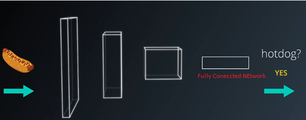

 
If I want to change my task to answer the question, "where in the picture is the hotdog?". The question is much more difficult to answer since fully connected layers don't preserve spatial information. If I change the classification network  from the connected layers to convolutional layers to create fully convolutional networks or FCN's for short. 

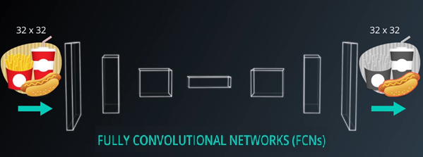

 
FCN's help us answer where is the hotdog question because while doing the convolution they preserve the spatial information throughout the entire network. 

In a classic convolutional network with fully connected final layers, the size of the input is constrained by the size of the fully connected layers. Passing different size images through the same sequence of  convolutional layers and flattening the final output. These outputs would be of different sizes which doesn't bode very well for matrix multiplication. Additionally, since convolutional operations fundamentally don't care about the size of the input, a fully convolutional network will work on images of any size. I will dive more into details of fully convolutional networks next. 

# 2. Fully Convolutional Networks
 Fully Convolutional Networks have achieved state of the art results in computer vision tasks,such as semantic segmentation. FCNs take advantage of three special techniques:
<b>
  1.	replace fully connected layers with one by one convolutional layers
  2.	up-sampling through the use of transposed convolutional layers
  3. skip connections.
</b> 
The skip connections allow the network to use information from multiple resolution scales. As a result the network is able to make more precise segmentation decisions. I will discuss these techniques in greater detail shortly. 

Structurally an FCN is usually comprised of two parts (see image below):

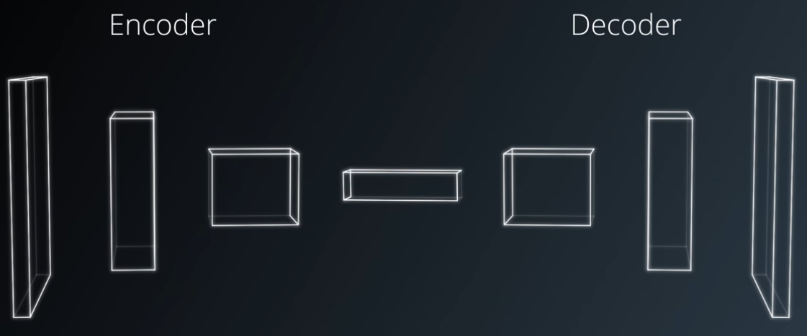

 
  1.	encoder 
  2.	decoder. 

The encoder is a series of convolutional layers like VGG and ResNet. The goal of the encoder is to extract features from the image. The decoder up-scales the output of the encoder such that it's the same size as the original image. Thus, it results in segmentation or prediction of each individual pixel in the original image. 

 
### 2.1. Fully Connected to 1x1 Convolution

the first special technique in FCNs replaces a fully connected layer(from the classification networks) with one by one convolutional layers. This will result in the output value with the tensor, which has 4D instead, 2D, so spatial information will be preserved. 

Recall, the output of the convolution operation is the result of sweeping the kernel over 
the input with the sliding window and performing element wise multiplication and summation. 

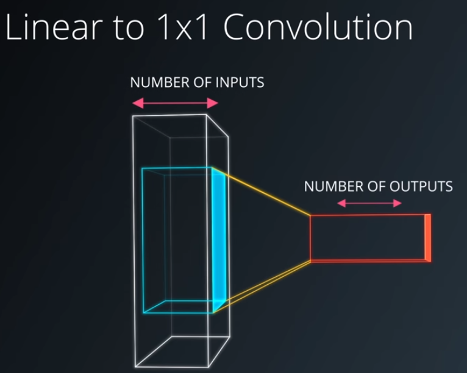

 
 One way to think about one by one convolutional layers is the number of kernels is equivalent to the number of outputs in a fully connected layer. Similarly, the number of weights in each kernel is equivalent to the number of inputs in the fully connected layer. Effectively, this turns convolutions into a matrix multiplication with spatial information.
 
#### 1x1 Convolution Exercise

In this [exercise](https://github.com/A2Amir/Fully-Convolutional-Networks--FCNs--/blob/master/Code/FullyConnectedto1x1ConvolutionExercise.ipynb) I am going to rewrite a dense layer, tf.layers.dense as a convolutional layer, tf.layers.conv2d. The underlying math will be the same, but the spatial information will be preserved allowing seamless use of future convolutional layers.

### 2.2. Transposed Convolutions

Using the second special technique, I can create decoder of FCN's using transposed convolution. A transpose convolution is essentially a reverse convolution in which the forward and the backward passes are swapped. Hence, we call it transpose convolution. Some people may call it deconvolution because it undoes the previous convolution. Since all we're doing is swapping the order of forward and backward passes, the math is actually exactly the same as what I have done earlier. The [property of differentiability]( https://en.wikipedia.org/wiki/Differentiable_function) is thus retain and training is simply the same as previous neural networks. 

Actually Transposed Convolutions help in [upsampling](https://en.wikipedia.org/wiki/Upsampling) the previous layer(one by one) to a higher resolution or dimension. Upsampling is a classic signal processing technique which is often [accompanied by interpolation](https://dspguru.com/dsp/faqs/multirate/interpolation/).

As an example, suppose I have a 2x2 input and a 3x3 kernel; with "SAME" padding, and a stride of 2 I can expect an output of dimension 4x4. The following image gives an idea of the process.

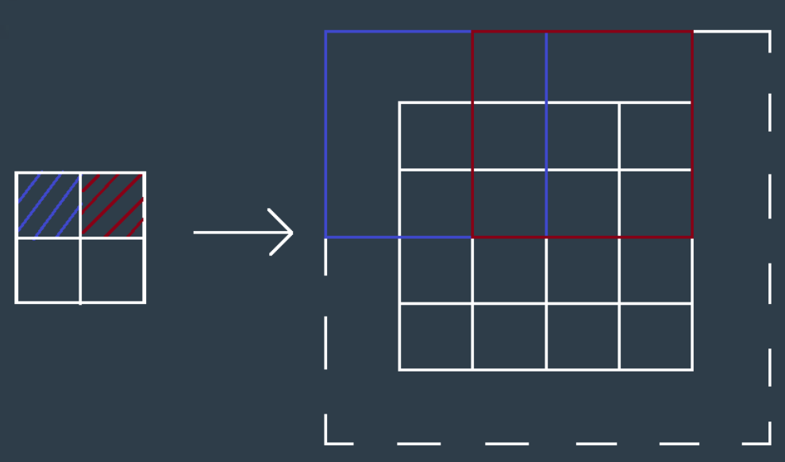

 
The 3x3 weighted kernel (product of input pixel with the 3x3 kernel) is depicted by the red and blue squares, which are separated by a stride of 2. The dotted square indicates the padding around the output. As the weighted kernel moves across, the stride determines the final dimension of the output. Different values for these will resul in different dimensions for the upsampled output.

#### Transposed Convolutions Exercise

In TensorFlow, the API tf.layers.conv2d_transpose is used to create a transposed convolutional layer. Check this [exercise](https://github.com/A2Amir/Fully-Convolutional-Networks--FCNs--/blob/master/Code/TransposedConvolutionsExercise.ipynb) to learn about the second technique in FCNs.

### 2.3. Skip Connections
The third special technique that fully convolution on networks use is the skip connection. One effect of convolutions (encoding in general) is I narrow down the scope by looking closely at some picture and lose the bigger picture as a result. So even if I were to decode the output of the encoder back to the original image size, some information has been lost. 

Skip connections are a way of retaining the information easily. The way skip connection work is by connecting the output of one layer to a non-adjacent layer. These skip connections allow the network to use information from multiple resolutions. As a result, the network is able to make more precise segmentation decisions. This is empirically shown in the following comparison between the FCN-8 architecture which has two skip connections and the FCN-32 architecture which has zero skip connections. 

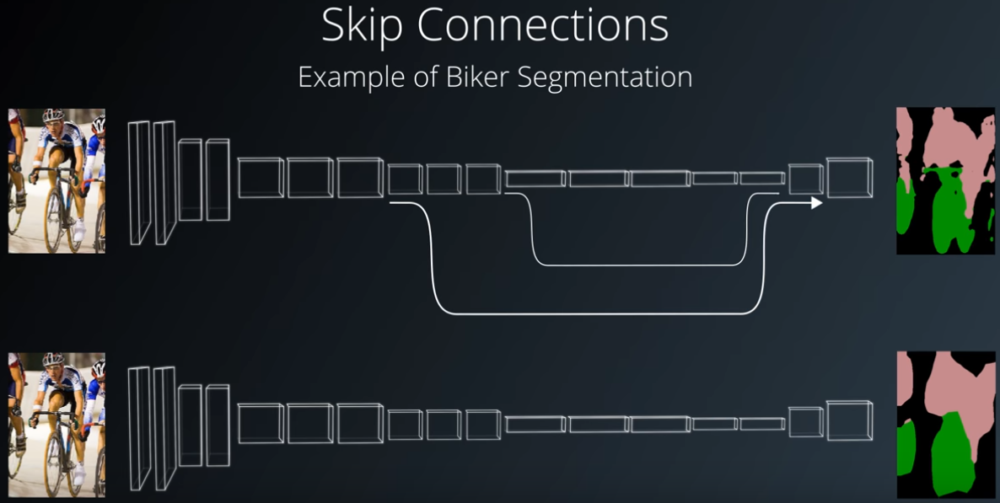

 
# 3. FCNs In The Wild

A FCN has two components, the encoder and the decoder. I mentioned that encoder extracts features that will later be used by the decoder. This may sound familiar to transfer learning: In fact, I can borrow techniques from transfer learning to accelerate the training of my FCNs. 

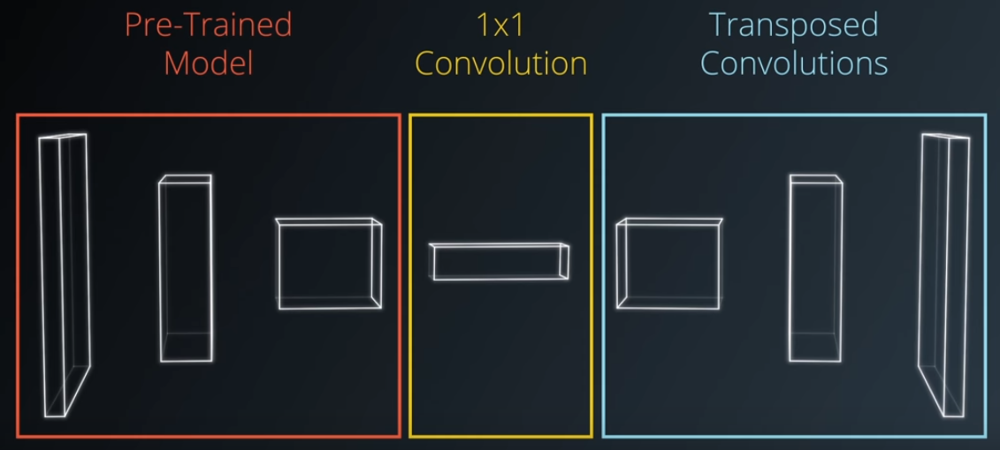

It is common for the encoder to be pre-trained on ImageNet. VGG and ResNet are popular choices, as examples. By applying the first special technique of one by one convolutional layer conversion, I can complete the encoder portion of the FCN. The encoder is followed by the decoder, which uses a second special technique of transposed convolutional layers to upsample the image. Then the skip connection via the third special technique is added.

**Note:** Be careful not to add too many skip connections It can lead to the explosion in the size of your model. For example, when using VGG-16 as the encoder only the third and the fourth pooling layers are typically used for skip connections.

In the next sections I'll use fully convolutional networks to tackle scene understanding and semantic segmentation. 

# 4. Scene Understanding

The first task is object detection and for that, I can use bounding boxes. They are a simpler method of scene understanding compared to segmentation. Neural network just has to figure out where an object is and draw a box around it. 
Note: There are already great open source state of the art solutions, such as YOLO and [SSD](https://github.com/A2Amir/Object-Detection--MobileNet-and-MobileNetSSD-) models. These models perform extremely well even at high frame per second. They're useful for detecting different objects such as roads, people, traffic lights, and other objects in the scene.

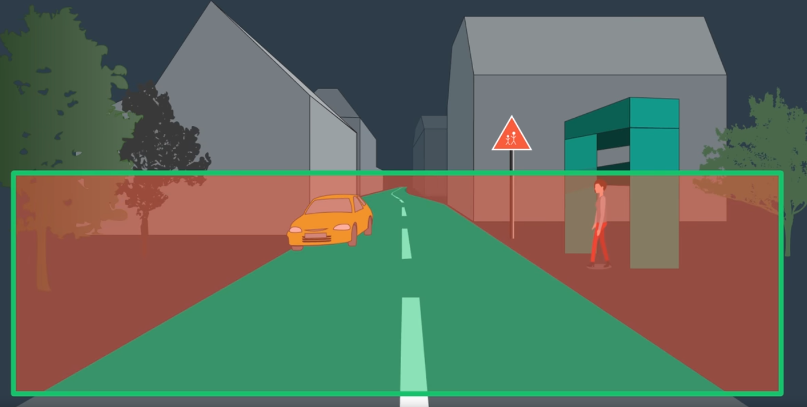

 
 However, bounding  boxes have their limits. As seen above drawing a bounding box around a curvy road (or the forest, or the sky) quickly becomes problematic or even impossible to convey the true shape of an object.  At best, bounding boxes can only hope to achieve partial scene understanding. 
 
In order to achieve scene understanding, semantic segmentation can be helpful. semantic segmentation is the task of assigning meaning to part of an object. This can be done at the pixel level where we assign each pixel to a target class such as road, car, pedestrian, sign, or any number of other classes (see image below). 

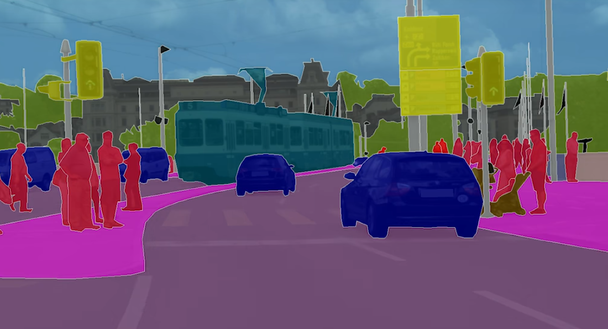

 
 Semantic segmentation help us derive valuable information about every pixel in the image rather than just slicing sections into bounding boxes. This is a field known as scene understanding.

One approach to full scene understanding is to train multiple decoders. Each decoder trains on a separate task. I might have one decoder for segmentation and another for depth measurement. So this I can have a single network which not only predicts the class of a pixel but additionally how far away it is (see image below). 

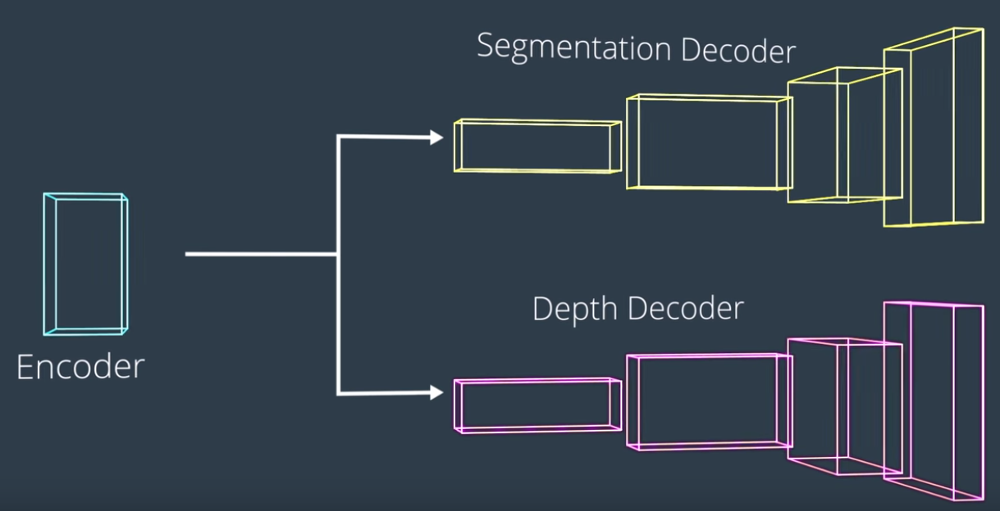

 
Imagine using this information (how far away it is and the class of a pixel) to reconstruct a rich 3D scene like how we human do. This is in fact, the next step to visual perception. For now, I'll keep things relatively simple focused just on semantic segmentation. 
 
 
# 5. Intersection Over Union (IoU)

 IOU is Intersection Over Union Metric, commonly used to measure the performance of a model on the semantic segmentation task. It is literally just the intersection set divided by the union set. 
 

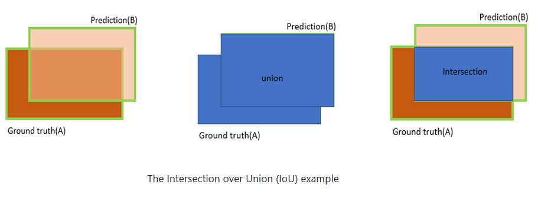

 
 Intersection of two sets is an AND operation. The intersection is defined as the number of pixels that are both truly part of that class and are classified as part of that class by the network (see Image above). 

Union of the two set is a OR operation. The union is defined as the number of pixels that are truly part of that class plus the number of pixels that are classified as part of that class by the network (see Image above).
 
**Note:**

* the intersection set should always be smaller or equal to the union set. The ratio then tell us the overall performance per pixel, per class. 
 

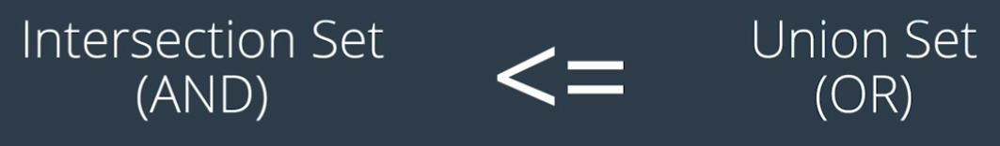

 
 * Since this intersection set is divided by the union set, the ratio will always be less than or equal to one. 
 
 

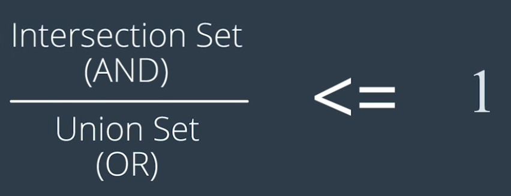

 
   I can go even further and calculate the mean IOU for a network, which is just the average of all the IOU for all the classes. This gives me an idea of how well it handles all the different classifications for every single pixel. 
 
### IOU calculation Steps

* Count true positives (TP)
* Count false positives (FP)
* Count false negatives (FN)
* Intersection = TP
* Union = TP + FP + FN
* IOU = Intersection/Union

 

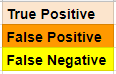

 
 
 

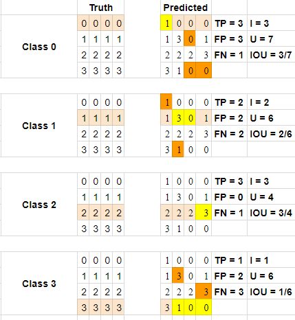

 
 In the above, the left side is the ground truth, while the right side contains the predictions. The highlighted cells on the left side note which class I am looking at for statistics on the right side.
The highlights on the right side note true positives in a cream color, false positives in orange, and false negatives in yellow (note that all others are true negatives - they are predicted as this individual class, and should not be based on the ground truth).

